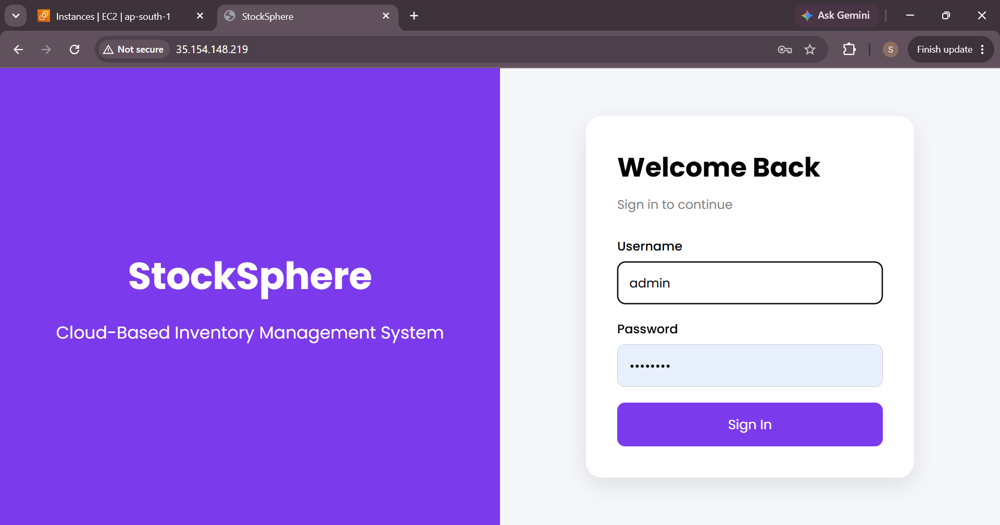
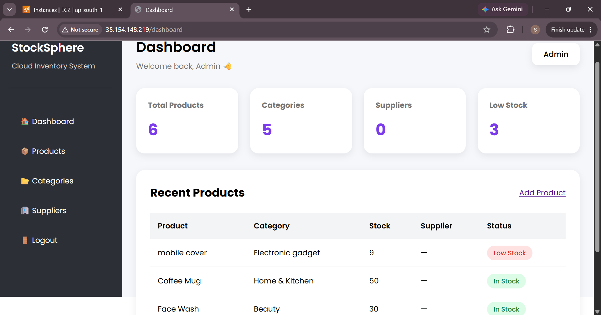
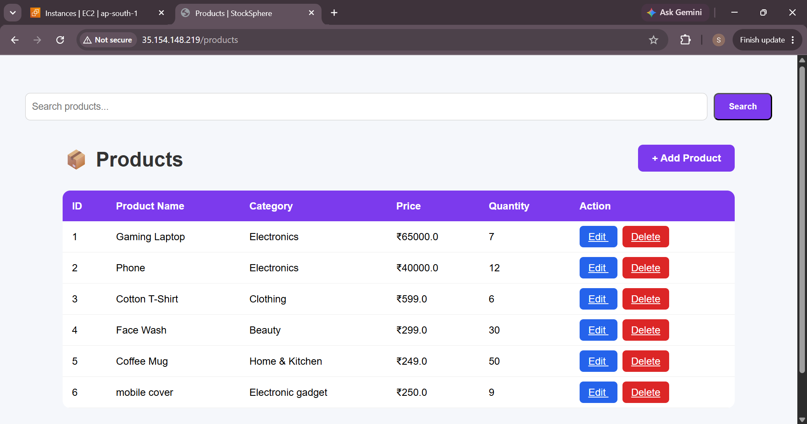
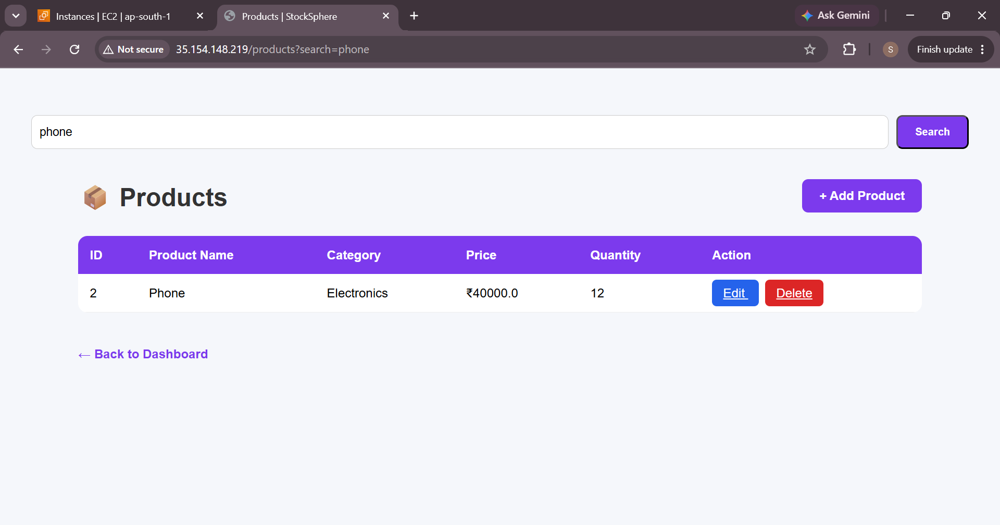
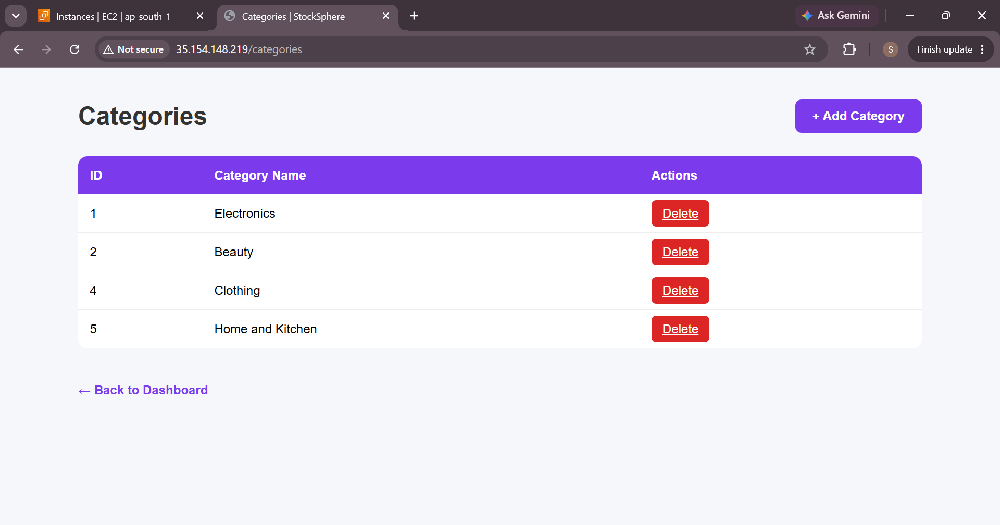
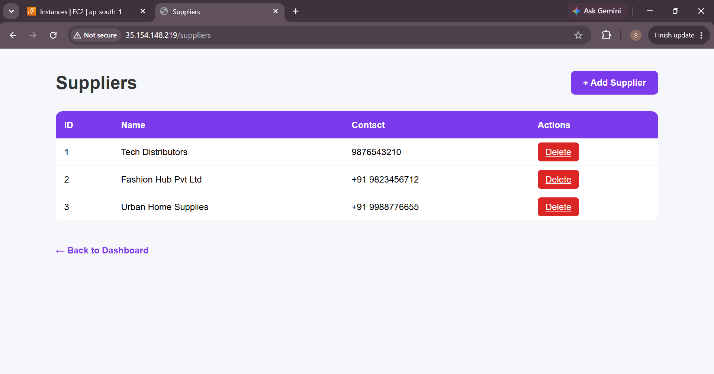
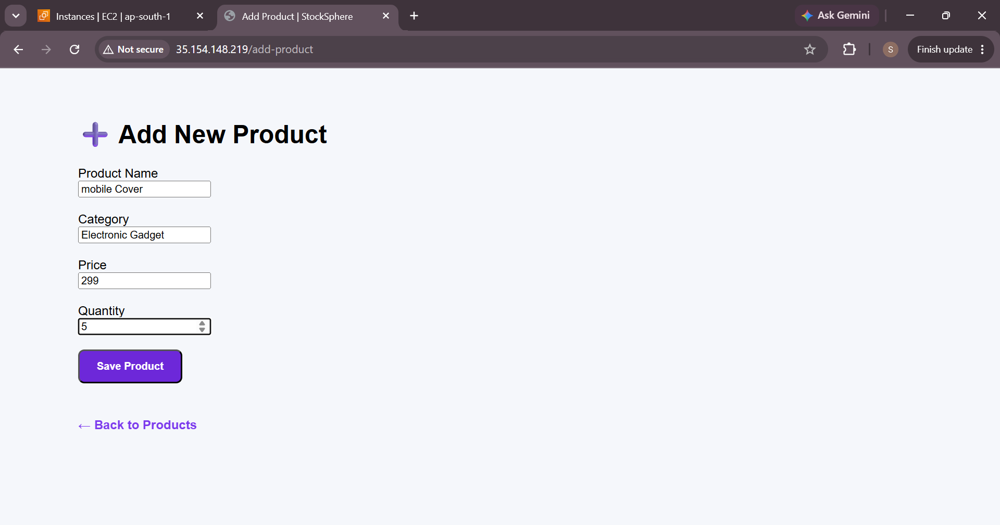

# 📦 StockSphere – Cloud Inventory Management System

StockSphere is a cloud-based inventory management system developed using Flask and deployed on AWS EC2 with Gunicorn and Nginx.

It helps businesses manage products, categories, suppliers, and inventory through a simple and responsive web interface.

---

## 🚀 Features

- User Login Authentication
- Dashboard Overview
- Product Management (Add, Edit, Delete)
- Category Management
- Supplier Management
- Product Search
- Responsive User Interface
- Cloud Deployment on AWS EC2
- Gunicorn + Nginx Production Server

---

## 🛠 Tech Stack

- Python
- Flask
- HTML5
- CSS3
- SQLite
- Gunicorn
- Nginx
- AWS EC2
- Ubuntu Linux

---

## 📸 Screenshots

### Login

### Dashboard

### Products

### Search Product

### Categories

### Suppliers

### Add Product

---

## ☁️ AWS Deployment

The application was deployed on an Amazon EC2 Ubuntu instance using:

- Gunicorn as the WSGI server
- Nginx as the reverse proxy
- Systemd service for process management

---

## 👩‍💻 Developed By

**Sanjana Gupta**
Bachelor of Engineering (Information Technology)
